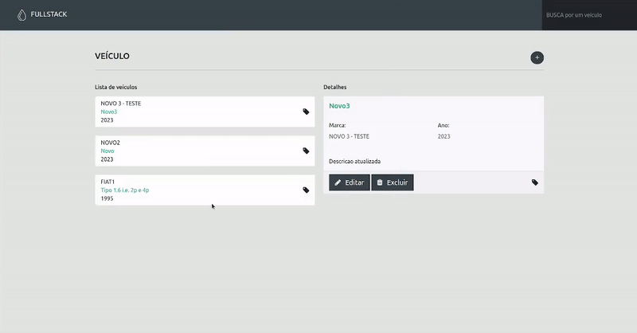

# Teste Fullstack PHP - Frontend


<br>

<p align="center">
  
</p>

<br>

## Tópicos

[Tecnologias](#tecnologias)

[Agradecimentos](#agradecimentos)

<br>

## Observação

Necessário possuir Docker instalado na máquina para rodar Backend e Frontend. Caso tenha mysql rodando na máquina, recomendo desativa para evitar conflitos de portas.

<br>

## Tecnologias do Frontend

Tecnologias e ferramentas utilizadas no desenvolvimento da Web:

- [PHP 8.1.0](https://www.php.net/releases/8.1/en.php)
- [Docker](https://www.docker.com/)
- [Apache 2](https://httpd.apache.org/)
- [Bootstrap 5.3.0](https://getbootstrap.com/docs/5.2)
- [sweetalert2](https://sweetalert2.github.io)
- [Jquery](https://jquery.com/)

<br>

## Instalação

```bash
# Rodando o servidor com docker
$ docker compose up --build

## Acessar usando IP da máquina
$ http:<SEU_IP>

## Em Service/VehicleService.php trocar o valor da url http://localhost:8000/veiculos para http://<SEU_IP>:8000/veiculos 
# De
$ private static $url = "http://localhost:8000/veiculos";
# Para
$ private static $url = "http://<SEU_IP>:8000/veiculos";
```

<br>

## Autor

[](https://github.com/savio-2-lopes)
[](https://www.instagram.com/savioaugulopes/)
[](https://www.linkedin.com/in/savio-lopes/)
[](mailto:savio.dev.lopes@gmail.com)

Feito com ❤️ por [Savio Lopes](https://www.linkedin.com/in/savio-lopes/)

---


## 💙 Agradecimentos

Gostaria de expressar meus sinceros agradecimentos à [4Events](https://github.com/4events) pela oportunidade de participar deste desafio. Se você encontrar algum problema ao executar os projetos ou tiver alguma dúvida, sinta-se à vontade para entrar em contato comigo. Estou aqui para ajudar e ficarei feliz em auxiliá-lo no que for necessário.
